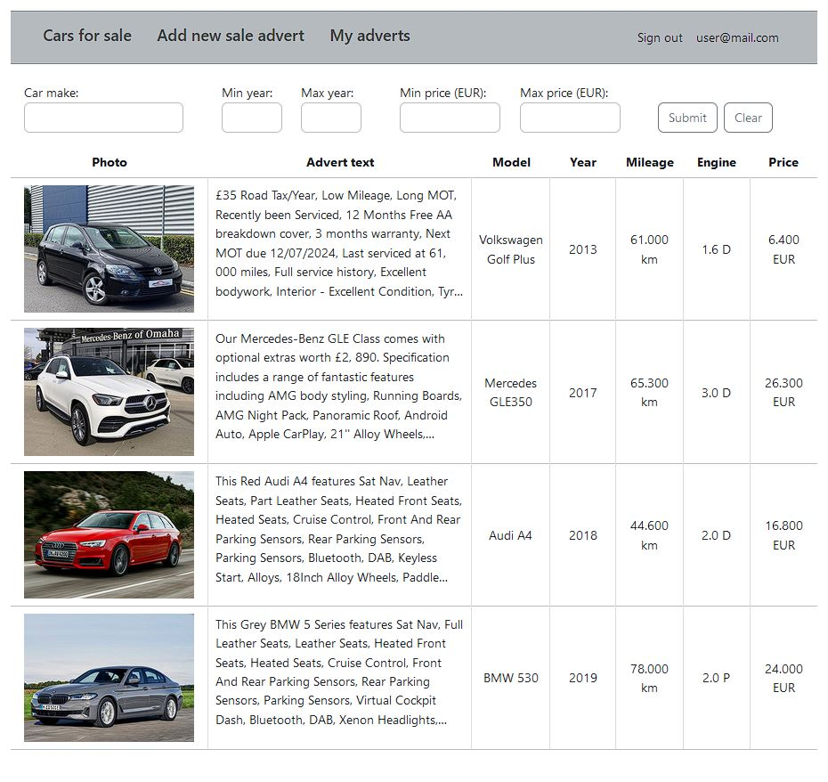
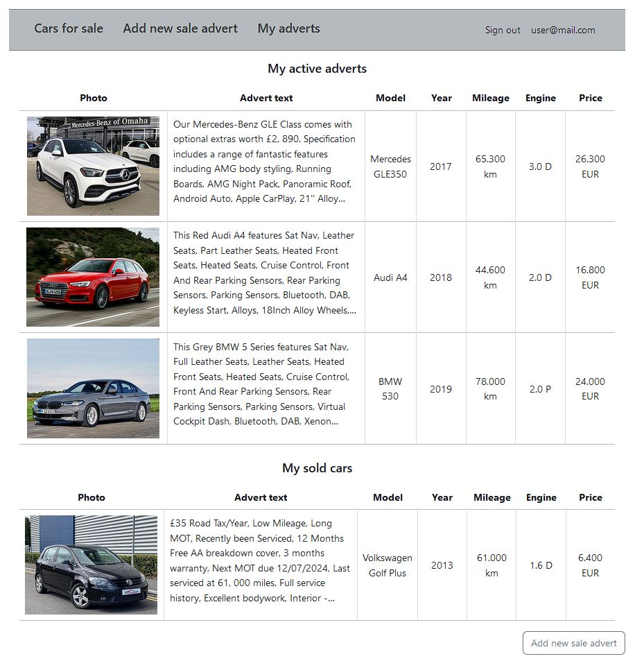

# Car sale web application

job4j_cars is a web application (with an emphasis on the server side of the site) which users can use to sell or buy cars.

---

### The main logic of the App:

* displaying all cars for sale
* for registered users is available to put new sale adverts and edit/update/delete their adverts
* user registration, sign in, sign out

---

### PostgreSQL DB tables:

Database tables are scripted with liquibase. DB schema:

Table car_model should be filled by all possible car makes/models.

---

### Used technologies:

* Java 17
* Maven 3.1.2
* PostgreSQL 14
* Spring Boot 2.7.6
* Junit Jupiter 5
* AssertJ 3
* Liquibase 4.15.0
* Hibernate
* Thymeleaf 3.0.4
* Bootstrap 5.3.0
* Checkstyle 3.1.2

---

### Run the project

Environment requirements: Java 17.0.2, PostgreSQL 42.5.1, Apache Maven 3.1.2

1. To run the project, you need to clone the project from this repository;
2. Then you need to create a local database "cars_db";
3. Specify the login and password for the database you created in the db/liquibase.properties and src/main/resources/hibernate.cfg.xml file;
4. Add image file name for default foto of a car (added if user did not add a photo of his car) and path to this file to the file src/main/resources/application.properties. Then add this data to script values scripts/009a_dml_insert_no_image_to_files_table.sql
5. Run liquibase to pre-create tables;
6. Launch the application using one of the following methods:
   1. Through the Main class, located in the folder src\\main\\java\\ru\\job4j\\cars;
   2. Compiling and running the project via maven with mvn spring-boot:run;
   3. After building the project via maven and running the built file with the command java -jar job4j\_cars-1.0-SNAPSHOT.jar;
7. Open the page [http://localhost:8080/index](http://localhost:8080/index) in the browser

---

### App screenshots

All adverts:

One advert:

Add new advert:

All my adverts:

Registration:

Login:

**Contacts:**
* name: Lidija Silantjeva
* email: dalilija@inbox.lv
* Telegram: @Lidik_sila